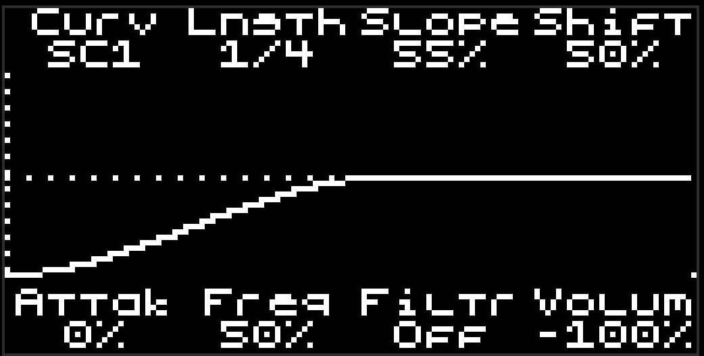

# PushNPull

### Creative sidechain effects for dummies.

A tempo-synced **curve shaper** audio FX for Schwung / Ableton Move.

A beat-locked curve runs in time with your project tempo and produces a bipolar
modulation signal that can **pull** (duck) or **push** (boost). Route it to the
output **Volume**, a multimode **Filter**, or both at once.

## Use case

Drop PushNPull on a bassline, pad, chord stab, or full bus to get instant,
compressor-free sidechain pumping locked to the beat — the classic "ducking under
the kick" four-on-the-floor move, with no kick routing required. Because the curve
is **bidirectional** and can also drive a filter, it doubles as a rhythmic
volume/filter LFO: gate, stutter, swell, tremolo, and filter-pump grooves on
sustained sounds.

It runs in **sync mode only** (locked to MIDI clock / project tempo; no MIDI-note
or audio-input triggering).

## How it works

Pick a shape — the **curve** — that repeats in time with your track. On every beat
(or whatever rate you choose) the curve sweeps the sound's **volume** down and back
up — that's the classic "pumping" duck under the kick — or it can sweep a **filter**
instead, or both at once. You can also flip it around so the curve *boosts* instead
of ducks.

That's it: choose a curve, set how often it repeats, and dial in how much it ducks
or boosts. Turn a knob to `0%` and that part simply does nothing, so you can keep it
as a simple volume pump, a filter sweep, or a mix of the two.

## On-device editing

Open the **Visual Edit** view for a live curve display (it redraws as you edit) with the
eight knobs mapped over it:

| Row | Knob 1 | Knob 2 | Knob 3 | Knob 4 |
|-----|--------|--------|--------|--------|
| **Top** (modulator) | CURV | LNGTH | SLOPE | SHIFT |
| **Bottom** | ATTAK | FREQ (cutoff) | FILTR | VOLUM |

The **jog wheel** cycles through curves. Filter *tone* params (model, mode,
resonance, drive) and **Output** live in the standard parameter menu.



## Parameters

### Modulator (the curve)

- **Curve** — the modulation shape. 12 curves:
  - *Sidechain 1* — classic: full duck on the beat, smooth recovery.
  - *Sidechain 2* — rounded dip, no instant drop.
  - *Punch* — fast (concave) recovery for a snappier pump.
  - *Sub Bass* — slow, near-linear recovery for smooth low-end ducking.
  - *Gate* — flat-bottom gate notch with click-safe edges.
  - *Reverse* — anticipatory "suction": ducks *into* the downbeat.
  - *Pulse* — two dips per cycle (on the beat and the off-beat).
  - *Push* — upward accent: boosts on the beat, then settles.
  - *Trim* — sharp duck with fast cubic recovery, for tightening tails.
  - *Swell* — a positive boost bump (groove on sustained sounds).
  - *Stutter* — trance gate: four quick gated dips per cycle.
  - *Pump* — bipolar push & pull: ducks on the beat, boosts mid-cycle, settles.
- **Length** — cycle rate: `1/8`, `1/4` (default), `1/2`, `1/1`. (Sets how often
  the curve repeats; it does not change the curve's depth or shape.)
- **Slope** — the active-window *width*: how much of the cycle the dip/rise
  occupies. Wider = longer ducking. Depth is unaffected.
- **Shift** — slides the whole curve earlier/later in the cycle (`50%` = centered,
  no offset) for groove/timing tweaks.
- **Attack** — softens the *onset*: eases into the curve over the first part of the
  cycle so the entry isn't an instant snap (tames the click). Depth is preserved —
  the dip/bump still reaches full strength, it just ramps in. `0%` = instant.

### Targets

- **Volume** — volume modulation depth, bipolar. `0%` = **Off**; negative ducks
  (default `-100%`), positive pumps/boosts.
- **Filter** — filter-cutoff modulation depth, bipolar. `0%` = **Off** (filter
  fully bypassed); negative closes the cutoff on the curve, positive opens it.

### Filter tone *(menu)*

- **Model** — `SVF` (state-variable) or `Schwoog` (transistor-ladder).
- **Mode** — `LP`, `HP`, `BP`, `Notch`, `Peak`, `AP` (SVF model).
- **Cutoff** (shown as **FREQ** on the canvas) — base filter cutoff that the Filter
  depth modulates around.
- **Resonance** — filter emphasis / Q.
- **Drive** — pre-filter saturation.

### Output & band split

- **Band Split** — when on, the Volume duck affects only the lows below **Band
  Freq**, leaving the highs untouched (pump the sub/kick region without dulling the
  top — invisible low-end ducking). *(menu)*
- **Band Freq** — the low/high crossover for Band Split (`20 Hz–5.1 kHz`). Shows
  `--` while Band Split is off. *(menu)*
- **Output** — final output level (`-24…+12 dB`). *(menu)*

## Build & install

```bash
./scripts/build.sh     # cross-compile pushnpull.so (Docker, aarch64)
./scripts/install.sh   # scp to Move; then restart the host
```

## Credits

Built on the DSP foundation of
[`schwung-filter`](https://github.com/charlesvestal/schwung-filter) (MIT) —
SVF and transistor-ladder filters, parameter smoother, and build/test infra. PushNPull adds the
MIDI-clock beat phasor, the curve bank + shaper (Slope/Shift/Attack), the
volume/band-split path, and the on-device curve editor.

License: MIT.
